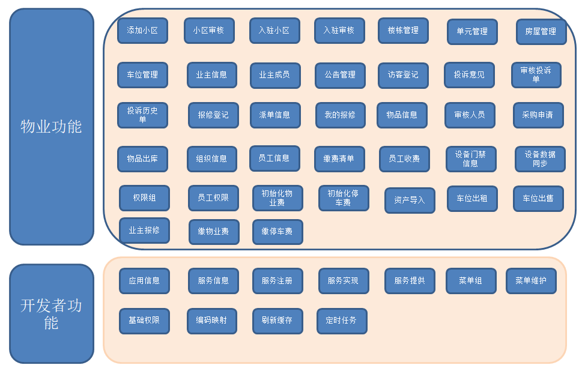
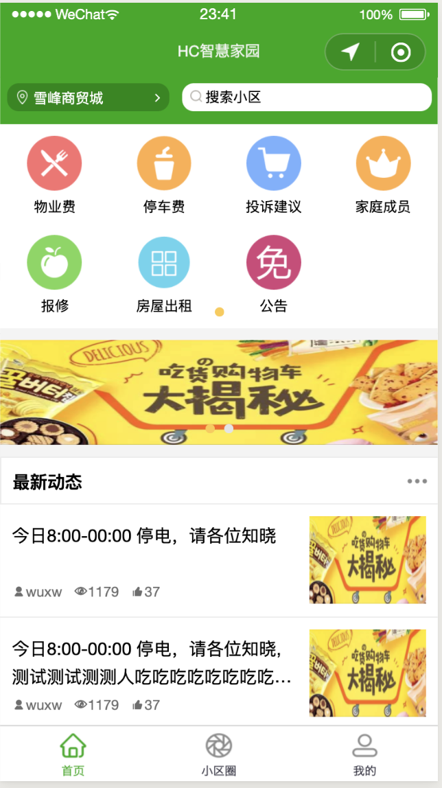
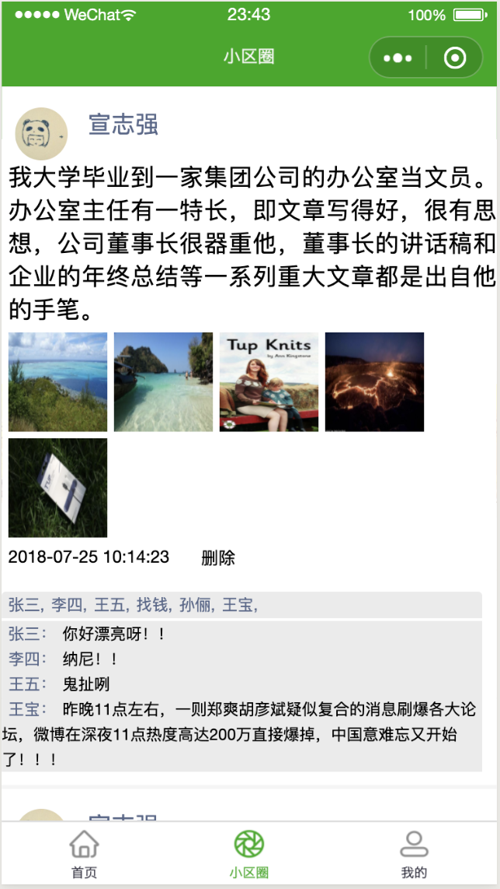
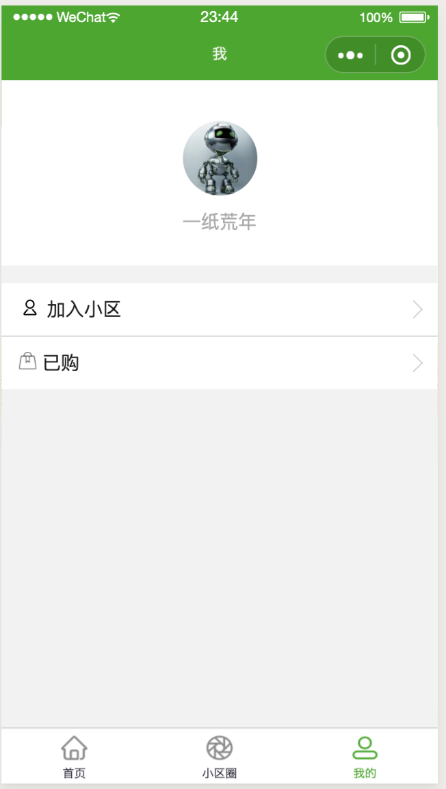

### HC智慧家园小程序

hc智慧家园小程序 是 HC小区开源项目的一个分支项目，主要给业主使用，其中包括缴物业费，缴停车费，投诉建议，家庭成员维护，房屋保修
房屋出租，公告查看，小区圈等功能。

### 官网

[http://www.homecommunity.cn](http://www.homecommunity.cn)

### 演示环境

1、 HC小区物业系统：

[http://www.homecommunity.cn](http://www.homecommunity.cn)

物业 账号/密码：wuxw/admin

代理商 账号/密码：dails/admin

运维团队 账号/密码：admin/admin

开发团队 账号/密码：dev/(由于开发者权限较大，删除数据会影响稳定性，查看具体功能，可以单独部署查看)

2、HC智慧家园

暂未上线，请下载代码后用微信开发者工具查看

### 分支说明

分支管理说明，test为最新代码未测试代码（主要为了防止本地代码遗失），master 为最新测试过代码（待产品化），product 为产品化代码

### 系统功能（function） 

   
   
   主要系统功能请查看
     
   [http://www.homecommunity.cn/document/#/func/funcation](http://www.homecommunity.cn/document/#/func/funcation)

### 相关文档

[http://www.homecommunity.cn/document/#/](http://www.homecommunity.cn/document/#/)

### 二次开发视频

[https://space.bilibili.com/403702784](https://space.bilibili.com/403702784)

### 运行效果

### 加入我们

加入HC小区交流群随时了解项目进度，和java110开发者零距离沟通 qq群号 827669685
